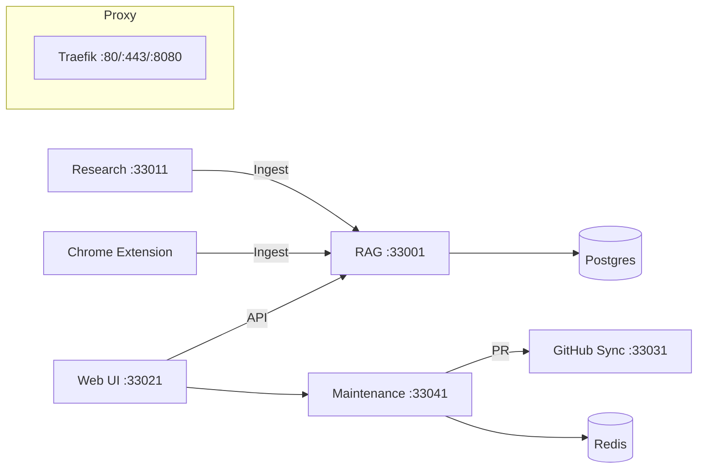

# JAEGIS NexusSync


NexusSync is a production-grade system that unifies research-driven RAG ingestion, automated dependency maintenance (OSV), GitHub PR automation, and an AGI-enabled Chrome extension for browser workflows—wrapped with a one-command Genesis Installer and CI/CD.

- Research Backend (FastAPI + Celery + Playwright)
- RAG Service (NestJS + Prisma + Postgres)
- Maintenance Service (NestJS + OSV) with Auto Patch-Bump PRs
- GitHub Sync (Fastify + Octokit) with JWT-secured PR endpoint
- Web UI dashboard (Maintenance surface and PR link)
- Chrome Extension (AGI Mode, DSL builder, templates, allowlist, dynamic permissions)
- Genesis Installer (single binary + Docker runner) with interactive wizard, headless config, TLS, and post-install HTML report

## Table of Contents
- Features
- Architecture
- Quick Start
- Installation (Windows, macOS, Linux)
- Usage
- API (Endpoints, Ports, Examples)
- Configuration
- Troubleshooting
- Contributing
- License

## Features
- End-to-end research and ingestion into RAG
- Automatic advisory research enqueue and narrative generation; narratives ingested into RAG
- Safe patch-level bumps with auto-PR creation across monorepo
- Chrome extension with DSL builder, workflows, AGI Mode with allowlist and dynamic permissions
- CI pipelines to build release installers and validate compose stack

## Architecture


## Quick Start
Prereqs: Docker + Docker Compose

- One command (no Go required):
  - Download the installer from Releases for your OS and run: `genesis-installer --quick`
- Or run via Docker (no Go/Node required):
  - See tools/genesis-installer/README.md for the docker run command

## Installation
- Interactive Wizard:
  - `genesis-installer --interactive`
  - Prompts: TLS (y/n), domain, email (for Let’s Encrypt)
- Headless Mode:
  - `genesis-installer --config=tools/genesis-installer/config.sample.yaml`
- Services and ports (defaults):
  - RAG 33001, Research 33011, GitHub Sync 33031, Web UI 33021, Maintenance 33041
- Env files generated at repo root: `.env.github-sync`, `.env.maintenance`, `.env.rag`, `.env.research`
- Compose override generated if absent: `docker-compose.override.yml`
- Post-install outputs: `install-report/report.txt` and `install-report/report.html`

## Usage
- Web UI: http://localhost:33021
- Maintenance API: http://localhost:33041/api/v1
  - Run audit: `POST /audit/run`
  - Status: `GET /audit/status` (includes last PR link)
- RAG API: http://localhost:33001/api/v1
  - Ingest: `POST /ingest`
  - Query: `POST /query`
- GitHub Sync: http://localhost:33031
  - PR: `POST /pr/create` (JWT required)
- Research Backend: http://localhost:33011
  - Enqueue research: `POST /api/v1/research`

### Example: Ingest to RAG
```bash
curl -X POST http://localhost:33001/api/v1/ingest \
  -H 'Content-Type: application/json' \
  -d '{"source":"demo://hello","content":"Hello NexusSync"}'
```

## API
- Health endpoints are available on all services (see Usage).
- OpenAPI: You can layer OpenAPI via Nest Swagger (RAG/Maintenance) and FastAPI built-in docs (Research). Contributions welcome.

## Configuration
- Ports: override via `docker-compose.override.yml` or installer config YAML
- Secrets: generated by installer, saved in `.env.*` files
- Proxy: Traefik on :80 and :8080 by default; TLS can be enabled via wizard or headless config

## Troubleshooting
- Logs: `docker compose logs -f SERVICE`
- Rerun installer: `--quick` or wizard/headless to repair
- Database ready check: `docker exec -it nexus-postgres pg_isready -U nexus`
- Port conflicts: adjust ports in override/installer config and re-run

## Contributing
- PRs welcome! Please open an issue for significant proposals.
- Add tests and update docs where applicable.

## License
MIT
